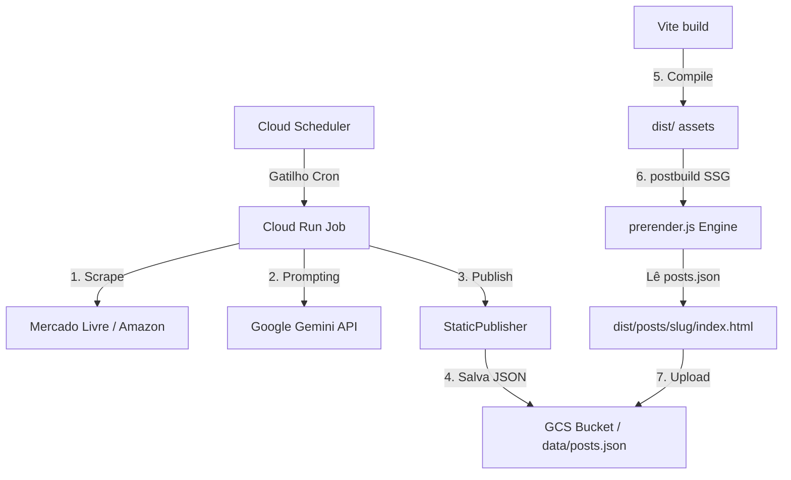

# Specification: Affiliate Pipeline & Vue.js Static Storefront

## 1. Visão Geral (Overview)
O sistema tem como objetivo automatizar a pesquisa, geração de conteúdo e publicação de comparativos de produtos focados em afiliados (Amazon e Mercado Livre). Ele avalia três categorias fundamentais por pauta: **O Mais Barato**, o **Melhor Custo-Benefício** e o **Modelo Premium** (Topo de Linha). 

Diferente do modelo tradicional de blogs dinâmicos baseados em bancos de dados relacionais e CMS pesados, este projeto foi migrado para uma **Arquitetura JAMstack Serverless Estática de Altíssima Performance**, onde a pipeline Python publica diretamente em um banco de dados estático JSON estruturado, e o frontend é servido através de uma aplicação SPA Vue.js 3 otimizada para SEO através de compilação e pré-renderização estática pós-build (SSG).

## 2. Metodologia de Desenvolvimento
*   **Test-Driven Development (TDD):** Todo novo código ou funcionalidade do backend começa com a criação de um teste unitário que falha ("failing test"). Somente após o teste falhar, a lógica de negócio é implementada para fazê-lo passar, seguida de eventual refatoração.
*   **Docker-First (Local Dev):** O ambiente local é isolado via Docker (`docker-compose` e `Dockerfile.dev`). Scripts utilitários encapsulam os comandos para execução de testes unitários e servidores locais dentro dos contêineres sem necessidade de dependências na máquina host.
*   **Infrastructure as Code (IaC):** O provisionamento na Google Cloud Platform (GCP) é estritamente automatizado usando Terraform.
*   **Controle de Versão Contínuo (Git/GitHub):** commits atômicos registram o progresso e o escopo exato de cada fase de desenvolvimento.
*   **Documentação Viva:** Os documentos `spec.md`, `context.md`, e `README.md` são atualizados continuamente para refletir a arquitetura ativa da solução.

---

## 3. Arquitetura da Solução (Data Flow)


1.  **Orquestrador Python (Cloud Run Job)**: Executado periodicamente, o scraper extrai dados de produtos. O `AIGenerator` cria as resenhas com IA. O `StaticPublisher` atualiza as resenhas no banco de dados centralizado em `public/data/posts.json` (GCS ou local).
2.  **Frontend Vitrine (Vue.js 3 + Vite)**: SPA estática responsiva de altíssima fidelidade visual consumindo as ofertas e dados diretamente do `/data/posts.json`.
3.  **Engine de Pré-Renderização (Node.js)**: Um utilitário de SSG pós-build (`prerender.js`) compila fisicamente cada comparativo em caminhos dedicados (ex: `dist/posts/[slug]/index.html`) injetando tags OpenGraph ricas e dados estruturados do Schema.org para indexação perfeita do Googlebot sem necessidade de execução do JavaScript client-side (Lighthouse SEO 100/100).
4.  **Hospedagem Estática**: Google Cloud Storage (GCS) configurado como hospedagem de site estático serverless.

---

## 4. Diretrizes de UI/UX e Design System (Vue.js Frontend)
O visual do storefront foi desenvolvido com foco em estética premium, velocidade de conversão e responsividade extrema.

*   **Design System Dark Glassmorphic**:
    *   Fundo preto espacial (`#0a0a0f`) combinado com painéis translúcidos em gradiente.
    *   Uso de sombras suaves e bordas de micro-brilho (`rgba(255, 255, 255, 0.06)`).
    *   Tipografia elegante: Fontes **Outfit** (para cabeçalhos, chamadas e logos) e **Inter** (para textos longos e descrições técnicas).
*   **Vitrines de Comparativos de Produtos**:
    *   **Página Inicial (Vitrine Curada)**: Painel hero com busca textual em tempo real e filtros por lojas parceiras. Exibe os comparativos em grades de cards horizontais compactos, apresentando os 3 produtos lado a lado com suas fotos em caixas isoladas, preços formatados em moeda nacional (BRL) e tags coloridas de destaque (Mais Barato em verde, Custo-Benefício em laranja, Premium em roxo). Inclui links diretos para checkout de afiliados e botão de visualização detalhada.
    *   **Página de Detalhes (`/posts/:slug`)**: Exibição da tabela comparativa com especificações completas, CTA de afiliado com efeito dinâmico ao passar o mouse e renderização semântica do artigo completo gerado pelo Gemini.
*   **Widget de Compartilhamento e Clipboard**:
    *   Links dinâmicos para compartilhamento instantâneo via WhatsApp, Facebook, Twitter e LinkedIn.
    *   Botão copiar link integrado com a API Clipboard do navegador, fornecendo feedback animado em tempo real ("✓ Copiado!").
*   **Otimização Mobile-First Extrema**: Cards horizontais colapsam elegantemente em colunas verticais simples em dispositivos móveis, com áreas de toque ampliadas para facilitar a conversão rápida de cliques de afiliado.

---

## 5. Estrutura de Dados (posts.json Schema)
O banco de dados estático em `posts.json` consiste em uma array ordenada de objetos de comparativo.
```json
[
  {
    "slug": "melhores-fones-de-ouvido-bluetooth-de-2026",
    "title": "Melhores Fones de Ouvido Bluetooth de 2026",
    "content": "<h2>Introdução</h2><p>Texto higienizado pelo Bleach...</p>",
    "date": "2026-05-06 12:00:00",
    "products": [
      {
        "title": "Fone Kaidi KD-771",
        "price": "59.90",
        "link": "https://mercadolivre.com.br/...",
        "image_url": "https://http2.mlstatic.com/...",
        "store": "Mercado Livre",
        "badge": "Mais Barato"
      },
      {
        "title": "Soundcore Anker Q30",
        "price": "349.90",
        "link": "https://mercadolivre.com.br/...",
        "image_url": "https://http2.mlstatic.com/...",
        "store": "Mercado Livre",
        "badge": "Custo-Benefício"
      },
      {
        "title": "Sony WH-1000XM5",
        "price": "1999.00",
        "link": "https://mercadolivre.com.br/...",
        "image_url": "https://http2.mlstatic.com/...",
        "store": "Mercado Livre",
        "badge": "Premium"
      }
    ]
  }
]
```

---

## 6. Especificação dos Módulos Python e Testes (TDD Backend)
O pipeline em Python opera livre de banco de dados dinâmico SQL ou CMS externo.

*   `src/publisher.py (StaticPublisher)`: 
    *   Responsável pela lógica de publicação estática.
    *   Gera slugs únicos amigáveis baseados no título do comparativo por normalização ASCII.
    *   Prepara e valida os dados de produto para as categorias rígidas de afiliados.
    *   Sanitiza o conteúdo gerado por IA usando a biblioteca `bleach`, expurgando execuções JavaScript (`<script>`) contra ataques de XSS.
    *   Efetua a escrita transacional de atualização (evitando posts duplicados e mantendo o histórico de revisões) no arquivo destino. Suporta gravação local e nuvem transparente no GCP pelo prefixo `gs://`.
*   `tests/test_publisher.py`:
    *   Garante conformidade do publicador estático por meio de testes de gravação inicial, atualização transacional por slug e sanitização de tag scripts.

---

## 7. Pré-Renderizador de SEO (SSG Node Engine)
O arquivo `storefront/prerender.js` realiza o carregamento do template compilado do cliente do Vite (`dist/index.html`) e os dados de `posts.json` para escrever fisicamente as páginas estáticas:
*   **Tags Sociais ricas (OpenGraph & Twitter Cards)**: Injeta tags `og:title`, `og:description`, `og:url` e preenche `og:image` dinamicamente com a imagem do primeiro produto listado no comparativo.
*   **Dados Estruturados Rich Snippets (Schema.org)**: Injeta um bloco `<script type="application/ld+json">` contendo o Schema de e-commerce (`Product` e `Offer` contendo preços, moedas, vendedor e link de checkout direto) para indexação estelar no Google.
*   **Fallback Semântico do Corpo**: Insere cabeçalhos (`<h1>`), tabelas HTML de produtos e o corpo do texto gerado por IA no container `#app` para fornecer indexabilidade instantânea.

---

## 8. Segurança e Infraestrutura Cloud (IaC)
A arquitetura serverless estática anula quase a totalidade dos vetores tradicionais de vulnerabilidade web (como SQL Injection, estouro de buffer, autenticação de sessão ou brute force de logins de CMS).

*   **Segurança de Hospedagem Estática**: O bucket do Google Cloud Storage armazena arquivos `.html`, `.js`, `.css` e `.json`. O controle IAM de acesso limita o acesso público exclusivamente como leitura estática (`roles/storage.legacyObjectReader` com o membro `allUsers`). 
*   **Privilégio Mínimo de Pipeline (IAM)**: A conta de serviço do Cloud Run Job (`affiliate-pipeline-sa`) é vinculada exclusivamente com permissões de administrador de escrita no Bucket de Hospedagem (`roles/storage.objectAdmin`) e acesso aos segredos do Gemini, sem acesso geral a outros recursos da nuvem.
*   **XSS Sanitization**: O sanitizador do backend Python garante que nenhum HTML malicioso chegue ao bucket estático.
